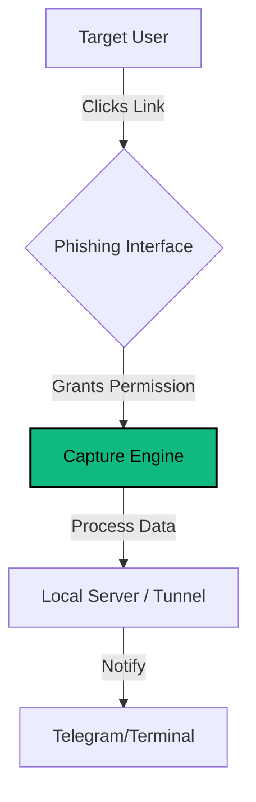

<div align="left">
  
</div>

<div align="center">

# CIPHER-CAMPHISH-PRO 😳

[](https://github.com/cipher-attack/camphish-pro)
[](https://github.com/cipher-attack/camphish-pro)
[](https://github.com/cipher-attack/camphish-pro)

---
<div align="center">

**"How private is your browser, really?"** *A hands-on project exploring how easily social engineering can turn browser permissions into security holes.*

</div>

### 🔍 Overview
**CIPHER-CAMPHISH-PRO** is a tool built to show what’s actually at stake when we manage browser permissions. By simulating a real-world social engineering scenario, it highlights how sensitive data—like your camera, location, and device details—can be accessed the moment a user unknowingly trusts a malicious link. 

The goal is simple: to prove that **'Allow'** is a powerful button that shouldn't be clicked blindly
---

### 🚀 Key Capabilities (What it can do)
This framework isn't just about links—it's about seeing what’s hidden. Here’s a breakdown of the core modules:

| Feature | What happens? | 
| :--- | :--- | 
| **📸 Camera Capture** | Instantly grabs high-quality snapshots the moment the user says "Allow." |
| **🛰️ Smart Geolocation** | Pinpoints exact coordinates to show how exposed a user's physical location can be. |
| **📱 Device Fingerprinting** | Digs deep into the hardware—revealing RAM, CPU, and even battery health. |
| **🌐 Network Recon** | Uncovers the real IP and tests for WebRTC leaks to see if a VPN is actually working. |
| **📋 Clipboard Audit** | Demonstrates how sensitive data (like passwords) can be peeked at from the clipboard. |
| **⚡ Secure Tunneling** | Uses fast and encrypted tunnels to send data back to your terminal instantly. |

---

### 🧪 Reality Check (Phishing Templates)
To make the testing feel real, the tool comes with pre-built scenarios that mimic everyday online experiences. These are designed to see if a user can spot the trap:

* **System Diagnostic:** Looks just like a routine browser update or a "fix-it" screen.
* **Video Conference:** A familiar Zoom/Teams-style interface that asks for camera access before "joining" a meeting.
* **Identity Verification:** A sleek template designed to look like a secure biometric or Face ID check.
* **Crypto-Assets:** Tests how users react when prompted to connect their wallets or verify assets.

---

### 🏗 System Architecture


```mermaid
graph TD
    A[Target User] -->|Clicks Link| B{Phishing Interface}
    B -->|Grants Permission| C[Capture Engine]
    C -->|Process Data| D[Local Server / Tunnel]
    D -->|Notify| E[Telegram/Terminal]
    style C fill:#10b981,stroke:#000,stroke-width:2px,color:#000
```

---

### 🦮 Usage Guide

**Designed for Linux & Termux Environments**

```bash
# 1. Clone the repository

git clone https://github.com/cipher-attack/camphish-pro.git

# 2. Navigate to directory & Grant permissions

cd camphish-pro && chmod +x *

# 3. Launch the framework

./cipher.sh
```

> **Pro Tip:** Use the **Cloudflared** option when testing over the internet (WAN) for better stability than Ngrok. Use **Localhost** for internal testing.

---

### 👤 About the Developer

<table border="0">
  <tr>
    <td width="150" align="center">
      
    </td>
    <td>
      <h3>Biruk Getachew (CIPHER)</h3>
      <p><i>Security Researcher & Mobile Dev Enthusiast</i></p>
      <p>A self-taught security researcher from Ethiopia with a passion for offensive security. I spend most of my time exploring privacy gaps and building tools—entirely from my mobile device using <b>Termux</b>. My mission is to make digital security understandable for everyone.</p>
      <p>
        <a href="https://github.com/cipher-attack"><b>GitHub</b></a> • 
        <a href="https://t.me/cipher_attacks"><b>Telegram</b></a>
      </p>
    </td>
  </tr>
</table>

---
### credit ==> Google Gemini pro

### ⚠️ Fair Warning & Disclaimer
**This project is built for education, not for trouble.**

`CIPHER-CAMPHISH-PRO` is a tool for security researchers and students to learn about vulnerabilities. Using this tool to target anyone without their explicit permission is not just unethical—it’s illegal. 

As the developer, I take no responsibility for how you choose to use this code. It is entirely up to you to stay within the boundaries of the law and use it only for ethical testing. **Play fair and stay legal.**

<div align="center">
  
</div>
